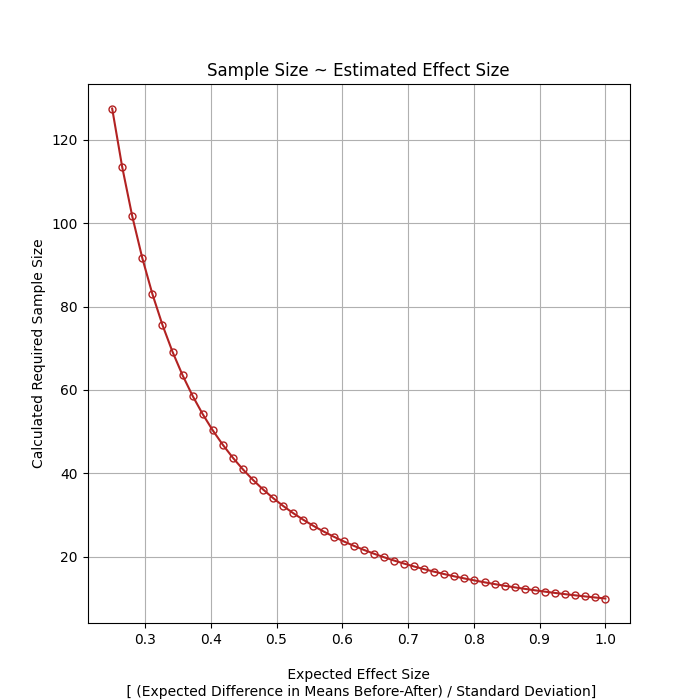
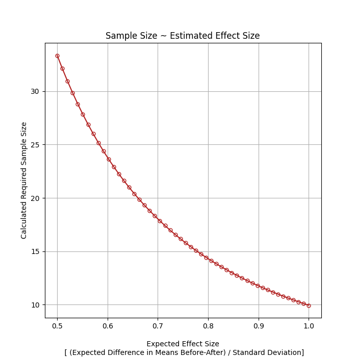
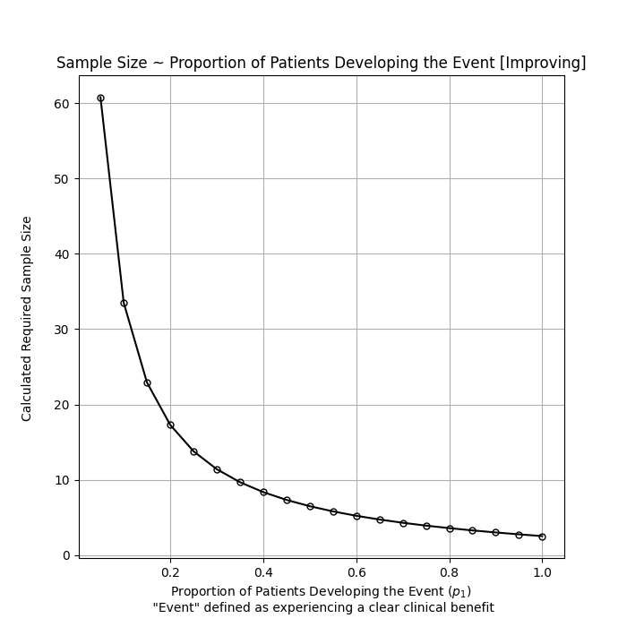

# Power Analysis for Sample Size Estimation

## Description Option 1
## Paired T-test using absolute mean in **MDS-UPDRS Tremor Score**

Python code for conducting a power analysis to estimate the sample size needed. The first power analysis is based on the expected effect size, which is defined as:

$$
\frac{{\text{{(Mean Tremor Before}} - \text{{After)}}}}{{\text{{Standard Deviation}}}}
$$


[Source Calculations](https://github.com/statsmodels/statsmodels/blob/main/statsmodels/stats/power.py)


## Code


```python
import numpy as np
import matplotlib.pyplot as plt
from statsmodels.stats.power import tt_solve_power

# Set parameters
alpha = 0.05
power = 0.80
effect_sizes = np.linspace(0.5, 1, 50)  # Range of effect sizes from 0.5 to 1
sample_sizes = []

# Calculate sample size for each effect size
for effect_size in effect_sizes:
    std_effect_size = effect_size
    n = tt_solve_power(effect_size=std_effect_size, alpha=alpha, power=power, alternative='two-sided')
    sample_sizes.append(n)

# Plot

plt.figure(figsize=(7, 7))
plt.plot(effect_sizes, sample_sizes, marker='o', linestyle='-', markerfacecolor='none', markersize=5, color='firebrick')

plt.title('Sample Size ~ Estimated Effect Size')
plt.xlabel('\n Expected Effect Size \n [ (Expected Difference in Means Before-After) / Standard Deviation]')
plt.ylabel('Calculated Required Sample Size')
plt.grid(True)

plt.show()
```


## Figures 
### Diffrent *x*-axis reference

<div style="display: flex;">
  
  
</div>


## Description Option 2
## Proportion Test using % of patients developing event, or **Experiencing Clinical Benefit**

Python code for conducting a power analysis to estimate the sample size needed. The second power analysis is based on the expected effect size calculated differently, which is defined as:

$$
2 \times \left( \arcsin\left( \sqrt{p_1} \right) - \arcsin\left( \sqrt{p_2} \right) \right)
$$

Note that *p*2 is always set to zero (0), baseline.


[Source Calculations](https://github.com/statsmodels/statsmodels/blob/main/statsmodels/stats/power.py)


## Code


```python
import numpy as np
import statsmodels.stats.power as smp

# Set parameters
alpha = 0.05  # Significance level
power = 0.80  # Desired power
p2 = 0.0  # Expected proportion under the alternative hypothesis (if any)

sample_sizes = []

# Calculate sample size for each value of p1
for p1 in np.linspace(0.05, 0.8, 20):
    # Calculate effect size
    effect_size = 2 * (np.arcsin(np.sqrt(p1)) - np.arcsin(np.sqrt(p2)))
    
    # Perform power analysis
    nobs = smp.NormalIndPower().solve_power(effect_size=effect_size, alpha=alpha, power=power, alternative='larger')
    
    sample_sizes.append(nobs)


# Plot
import matplotlib.pyplot as plt

plt.figure(figsize=(7, 7))
plt.plot(np.linspace(0.05, 1, 20), sample_sizes, marker='o', linestyle='-', markerfacecolor='none', markersize=5, color='black')
plt.title('Sample Size ~ Proportion of Patients Developing the Event [Improving]')
plt.xlabel('Proportion of Patients Developing the Event ($p_1$) \n "Event" defined as experiencing a clear clinical benefit')
plt.ylabel('Calculated Required Sample Size \n')
plt.grid(True)
plt.show()
```


## Figure

<div style="display: flex; justify-content: center;">
  
</div>
